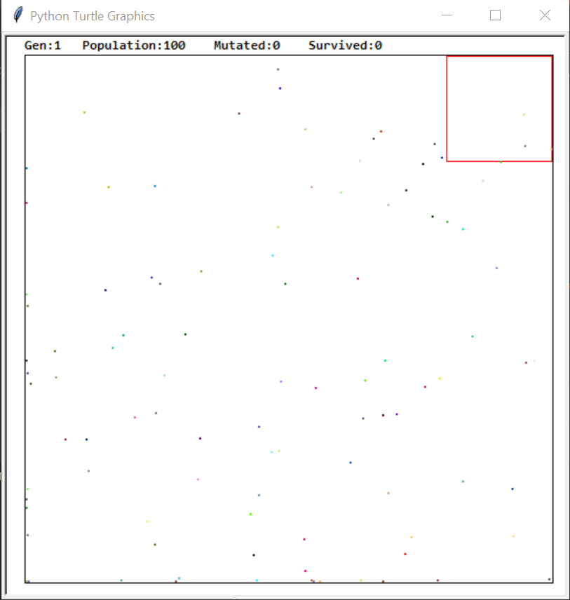

# Costum_Neural_Network
the idea is not mine. i got it from this: https://www.youtube.com/watch?v=N3tRFayqVtk

but I wrote everything from scratch, not looking at any code.
the dots in the picture are my creatures that have a very simple brain. the brain decides in which direction the creature should move. the brain is a list of cells with a list of cell relations. each cell does something to the data and lends it to the next cell until the "last cell" where the decision is executed.

this is the environment:

generations pass and the creatures evolve to make it to the red squere...
there are options for obstacles too.
